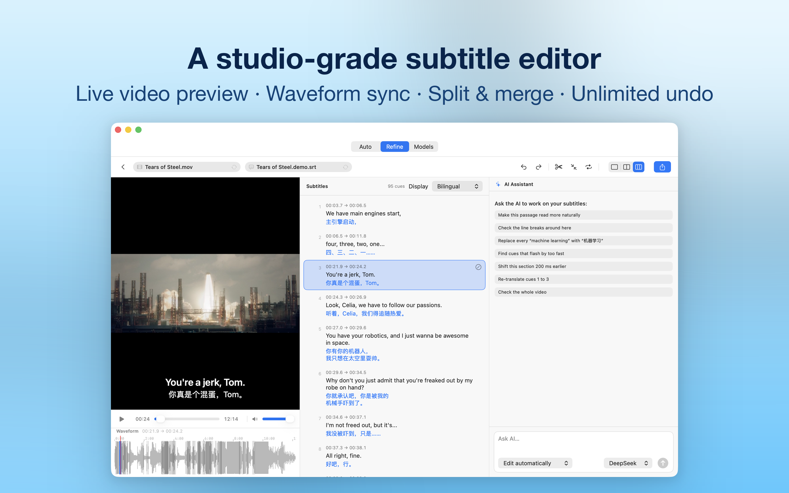
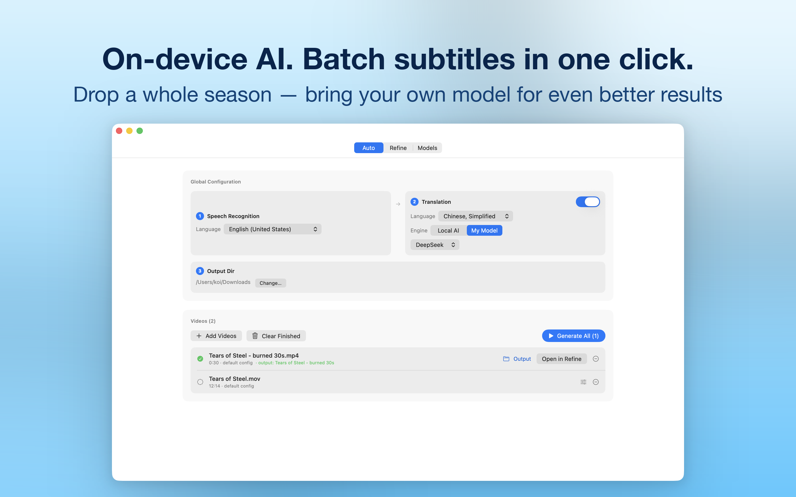
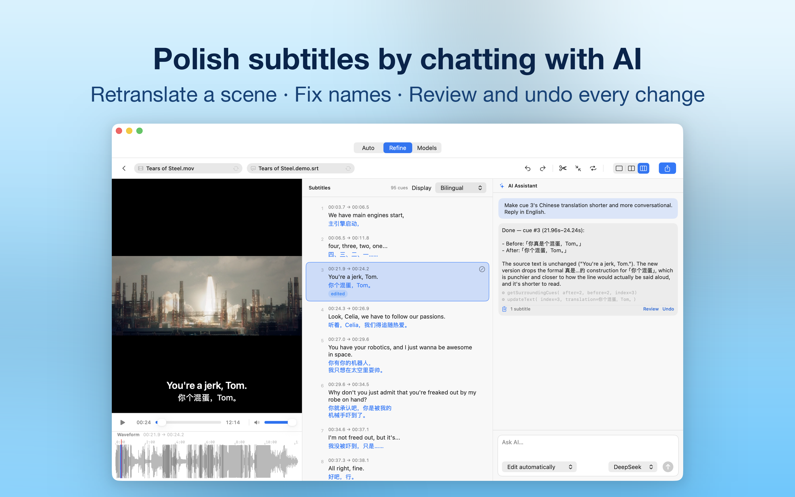

# KenjaSub

**AI subtitle studio for Mac** — on-device transcription, context-aware translation with your own AI model, and a frame-accurate bilingual subtitle editor.

*Every film deserves perfect subtitles.*

  

<em>The Refine studio — video, synchronized cue list, waveform timing, and an AI assistant that edits subtitles conversationally.</em>

**[Download on the Mac App Store · Free](https://apps.apple.com/us/app/kenjasub-video-subtitle-editor/id6812369916) · [Website](https://kenjahub.github.io/KenjaSub/) · [中文介绍](#中文介绍) · [Privacy Policy](privacy.md) · [Support](https://github.com/KenjaHub/KenjaSub/issues)**

---

KenjaSub turns any video into polished bilingual subtitles — **transcribed on device, translated in context, and refined frame by frame** in a built-in studio. It's a native Mac tool, private by default: no accounts, no analytics, no tracking.

> "Kenja" is Japanese for *sage* — the wise one. Building smarter software is the mission.

## How it works

| | |
|---|---|
| **Auto** | Drop several videos, get subtitle files. Speech recognition, translation and export run as one batch queue with per-video overrides, live progress and one-click retry. |
| **Refine** | A full studio on top of your video: an mpv-based player that opens MKV, WebM and AVI natively, a synchronized cue list with waveform, undo/redo, split and merge, and instant export to SRT or WebVTT. |
| **Models** | Bring your own key. Add any OpenAI-compatible provider — OpenAI, DeepSeek, OpenRouter, Ollama, LM Studio or a custom endpoint. Keys live in your Mac's Keychain, never in plain files. |

## Highlights

- **On-device transcription** — speech recognition runs with Apple's SpeechAnalyzer. Your audio never leaves your Mac.
- **Translation that reads the whole film** — subtitles are translated in context windows, so pronouns, tone and recurring names stay consistent across the whole video. Six registers: Natural, YouTube, Conversational, Professional, Documentary or Literal.
- **Chat with your subtitles** — the built-in AI assistant retranslates scenes, shortens lines and fixes names conversationally. "Ask before changes" stages every edit as a reviewable diff; automatic mode applies instantly with one-click undo per chat turn.
- **Frame-accurate timing** — drag cue boundaries on the waveform, set in/out points at the playhead (⌘[/⌘]), type exact timecodes, split, merge, or shift the whole track. Full undo history.
- **Bilingual SRT import** — existing translations come along, with automatic language detection.
- **Readable by design** — reading-speed and line-length checks; when a source language or model answer looks wrong, KenjaSub stops and tells you instead of silently saving a bad file.
- **Private by default** — no accounts, no analytics, no tracking. AI features are strictly bring-your-own-key: subtitle text goes only to the provider you configured, only when you choose that engine. A fully local engine (Apple's Translation framework) is built in.

## Requirements

macOS 26 or later. On-device transcription and translation use Apple's neural frameworks — Apple Silicon recommended. **Free on the [Mac App Store](https://apps.apple.com/us/app/kenjasub-video-subtitle-editor/id6812369916).**

KenjaSub does not include AI model access; AI translation and the assistant require an API key from a provider you choose.

## FAQ

**Does KenjaSub upload my video or audio?**
No. Transcription runs entirely on your Mac. When you choose an AI translation engine, subtitle text is sent only to the provider you configured.

**Which formats are supported?**
MKV, WebM, AVI natively via mpv (plus MP4/MOV). Subtitles import and export as SRT and WebVTT.

**Which AI providers work?**
Any OpenAI-compatible endpoint: OpenAI, DeepSeek, OpenRouter, Ollama, LM Studio, or your own server — or use the on-device Apple Translation engine with no key at all.

**Can I fix timings manually?**
Yes — waveform drag, playhead in/out points, typed timecodes, split, merge, global time shift, and undo for all of it.

## Links

- [Download on the Mac App Store](https://apps.apple.com/us/app/kenjasub-video-subtitle-editor/id6812369916) — free
- [Website](https://kenjahub.github.io/KenjaSub/) — features, FAQ and privacy in one page
- [中文页面](https://kenjahub.github.io/KenjaSub/zh.html)
- [Privacy Policy](privacy.md)
- [Support / Issues](https://github.com/KenjaHub/KenjaSub/issues)

---

## 中文介绍

**KenjaSub 是一款 Mac AI 视频字幕编辑器**：把任何视频变成精修过的双语字幕——设备本地听写、带着上下文翻译、再在内置的视频工作台里逐条打磨。

Kenja 在日语中意为「智者」（sage）——这也是我们的目标：开发更智能的软件。

### 三个标签页，一条工作流

- **Auto** —— 拖入多个视频，一次出全套字幕。听写、翻译、导出组成批量队列，支持逐视频覆盖配置、实时进度与一键重试。
- **Refine** —— 完整的字幕精修工作台：基于 mpv 的播放器原生支持 MKV、WebM、AVI；字幕列表与波形图同步；撤销重做、拆分合并、整体平移；一键导出 SRT 或 WebVTT。
- **Models** —— 自带 Key。接入任何 OpenAI 兼容服务（OpenAI、DeepSeek、OpenRouter、Ollama、LM Studio 或自建端点），密钥只存在 Mac 的钥匙串里。

### 特色

- **听写完全本地** —— Apple SpeechAnalyzer 在设备上运行，音频不出你的 Mac
- **读懂整部片的翻译** —— 按上下文窗口翻译，代词、语气连贯，人名与术语全片统一；六种风格任选
- **和字幕对话** —— AI 助手用聊天方式改字幕；「修改前询问」把每处修改暂存为可审阅的 diff，「自动修改」立即生效、任意一轮可撤销
- **帧级时间控制** —— 波形拖拽、播放头设入出点（⌘[ / ⌘]）、精确时间码、拆分合并、整体平移，全部可撤销
- **默认保护隐私** —— 无账号、无统计、无追踪；AI 功能严格自带 Key

### 系统要求

macOS 26 或更高版本，推荐 Apple Silicon。[Mac App Store](https://apps.apple.com/us/app/kenjasub-video-subtitle-editor/id6812369916) 免费下载。KenjaSub 不附带 AI 模型访问；AI 翻译与助手需要你自己选择的服务商 API Key。

**[立即下载 · Mac App Store](https://apps.apple.com/us/app/kenjasub-video-subtitle-editor/id6812369916) · [中文官网](https://kenjahub.github.io/KenjaSub/zh.html) · [隐私政策](https://kenjahub.github.io/KenjaSub/privacy.html)**

---

© 2026 KenjaHub · [Privacy Policy](privacy.md) · [kenjasoft@kofukuai.com](mailto:kenjasoft@kofukuai.com)
